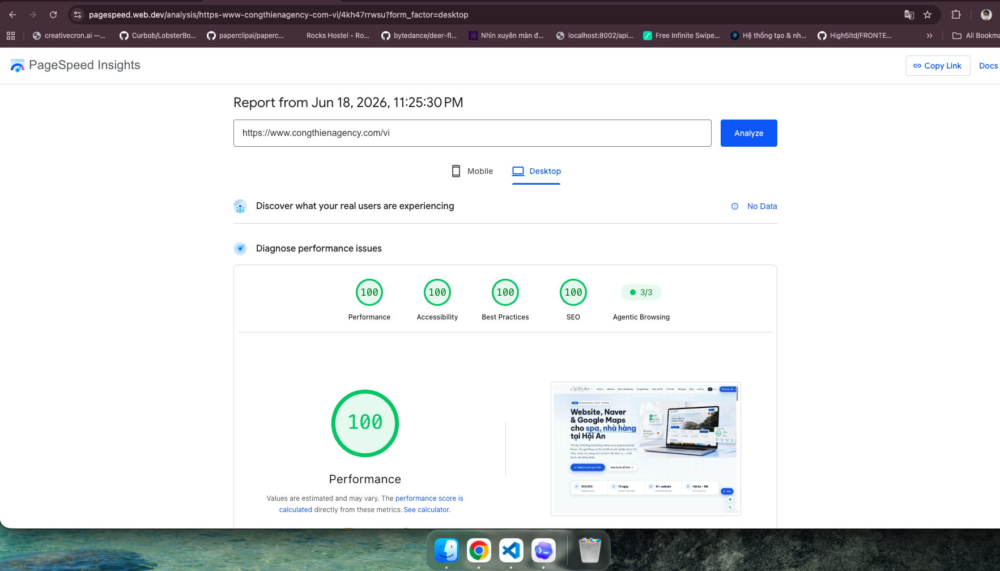
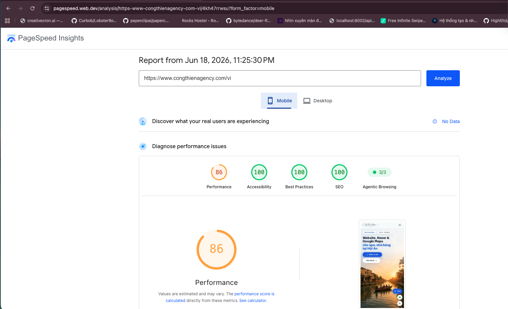

# Công Thiên Agency Website

Production website for Công Thiên Agency, a founder-led marketing and web agency focused on hospitality and local-service businesses in Hội An, Đà Nẵng, and Vietnam.

## TL;DR

- Founder-led marketing website built with `Next.js 15`, `React 19`, `TypeScript`, and `Tailwind CSS 4`
- Focused on SEO websites, Naver Marketing, Google Maps Marketing, and localized business content
- Technical SEO, AI-readable resources, and structured content are already integrated

## PageSpeed Snapshot

Desktop (`June 18, 2026`)



Mobile (`June 18, 2026`)



## Stack

| Area | Implementation |
| --- | --- |
| Framework | Next.js 15 App Router |
| UI | React 19 + TypeScript |
| Styling | Tailwind CSS 4 |
| SEO | Next metadata, canonical URLs, hreflang, JSON-LD |
| Content | Typed files in `content/` |
| Discovery | Sitemap, image sitemap, robots, AI resource routes |
| Deployment | Static-friendly Next.js setup |

## Repository Map

```text
app/                 App Router pages, metadata, sitemap, robots, AI resource routes
components/          Reusable UI components and sections
content/             Services, blog posts, pricing, projects, glossary, site identity
lib/                 SEO helpers, schema builders, routing helpers, AI resource helpers
public/              Images, icons, verification files, brand assets
scripts/             Utility scripts such as IndexNow submission
docs/                Architecture, SEO, AI, and operations notes
```

## Local Development

```bash
npm install
npm run dev
```

Open `http://localhost:3000/vi`.

## Validation

```bash
npm run build
```

Optional:

```bash
npm run indexnow
npm run indexnow -- --submit
```
